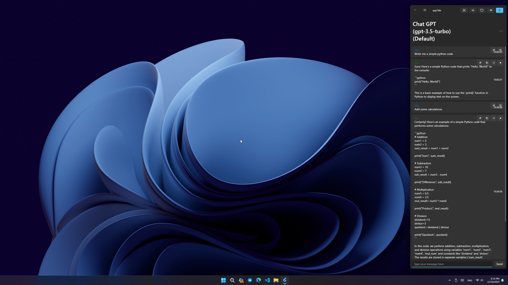
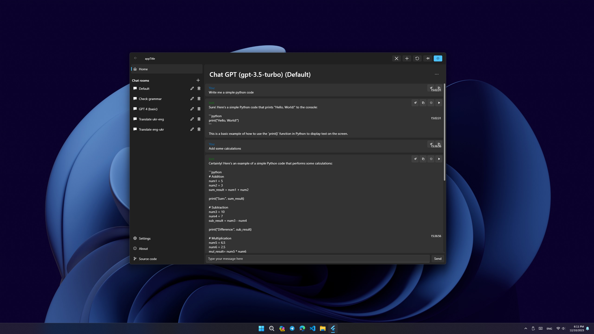
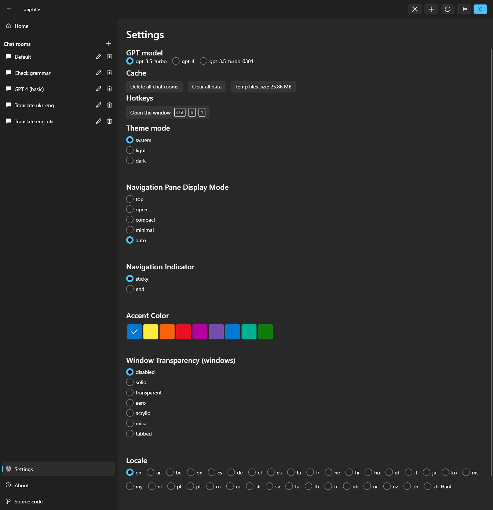

# Fluent GPT App

Welcome to Fluent GPT App, an open-source, multi-platform desktop application that brings the power of GPT models to your fingertips. Designed with a sleek Fluent interface, it offers a unique and customizable chat experience on Windows, macOS, and Linux.

## Features

- **Cross-Platform Support**: Works seamlessly on Windows, macOS, and Linux.
- **Tray Functionality**: Ability to minimize to the system tray for quick access.
- **Custom Shortcut Activation**: Open the app with a custom keyboard shortcut.
- **Multiple Chat Rooms**: Engage with different GPT models in separate chat rooms.
- **Custom Instructions**: Tailor each chat room with specific instructions or guidelines.
- **Integration with ChatGPT from OpenAI**: Use ChatGPT by obtaining a token from OpenAI.
- **Custom GPT**: You can use your own GPT models by providing a URL to the model. 
- **Pin app**: Pin the app to the top of your screen for easy access.
- **Search files support**: You can download and use "Everything" search engine to search files on your computer.
- **Shell support**: GPT can run shell commands on your computer.
- **Custom Prompts**: Users can create their custom prompts to use them faster in the chat and overlay.
- **Overlay Mode on Text Selection (macOS only)**: When users select text, the app will show a compact horizontal overlay with pre-created user's quick prompts.
- **Sidebar Mode**: The app will switch to a compact vertical overlay that will show custom user prompts.
- **Run Python Code**: GPT can run Python code locally, allowing for seamless integration and execution of scripts.

## Screenshots

## Getting Started

### Prerequisites

- Ensure you have the latest version of your operating system (Windows, macOS, Linux).

### Installation

1. Download the Fluent GPT App from [GitHub Releases](#).
2. Follow the installation instructions specific to your OS.

(optional)

3. Download the Everything search engine from [here](https://www.voidtools.com/support/everything/command_line_interface/) and place it inside the app folder.
4. Download and install python from [here](https://www.python.org/downloads/).

### Using ChatGPT from OpenAI

To use ChatGPT from OpenAI, you need to obtain a token:

1. Visit [OpenAI API](https://beta.openai.com/signup/) and sign up or log in.
2. Navigate to the API section and follow the instructions to get your API token.

### Using Your Own GPT Models

Fluent GPT App allows the integration of custom GPT models. To use your own model:

1. Ensure your GPT model is accessible via a URL.
2. In the app, tap on the Plus icon to add a new Chat Room. Then tap on the pencil icon to edit the room.
3. Check "Custom GPT" and enter your URL in the "Custom GPT URL" field.
4. Click "Save" to save your changes.

### Specific Instructions for gpt4All (COMING SOON!)

If you're using [gpt4All](https://github.com/nomic-ai/gpt4all), follow these steps:

1. Visit the [gpt4All GitHub page](https://github.com/nomic-ai/gpt4all).
2. Install gpt4All on your from the Releases section.
3. Ensure you enable the "Enable API server" setting in gpt4All. This allows Fluent GPT App to communicate with your gpt4All model.
4. Once gpt4All is running with the API server enabled, use the provided URL in Fluent GPT App to connect to your gpt4All model.

By following these steps, you can seamlessly integrate gpt4All or any other custom GPT model with Fluent GPT App.

### Configuration

- **Hiding to Tray**: Enable this in settings to allow the app to minimize to the system tray.
- **Setting Custom Shortcut**: Define your custom shortcut in the settings menu (Default Ctrl+Shift+1).
- **Adding/Managing Chat Rooms**: Create and manage chat rooms through the main interface. Assign different GPT models and set custom instructions for each room.

## Usage

Once you've set up your chat rooms, you're ready to start interacting with the GPT models. Simply select a chat room and start typing your queries or commands.

## Contributing

We welcome contributions!

## License

## License

This project is licensed under the Creative Commons Attribution-NonCommercial-NoDerivs 4.0 International License - see the [LICENSE.md](LICENSE.md) file for details.

Copyright (c) 2024 Alex Kalashnikov.

## Acknowledgments

- OpenAI for providing the GPT models.
- Contributors and supporters of the Fluent GPT App.

## Packages Used
- Flutter
- Provider
- fluent_ui
- system_theme
- flutter_acrylic
- go_router
- provider
- url_launcher
- window_manager
- chat_gpt_sdk
- shared_preferences
- intl
- chat_gpt_flutter
- system_tray
- hotkey_manager

---
Generated with ChatGPT-4